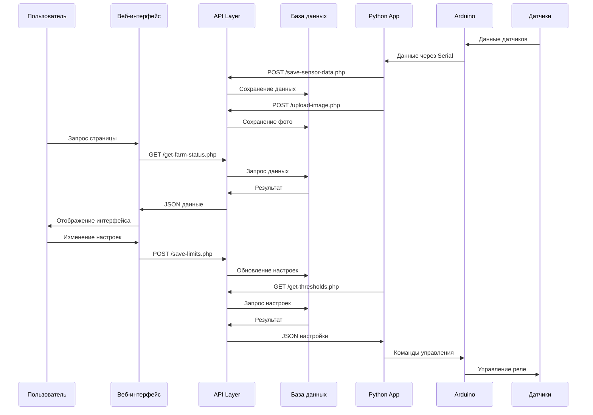

# 🌱 ФитоДомик - Система управления умной фермой

Комплексная система управления умной фермой, состоящая из веб-приложения для мониторинга и управления, а также Python приложения с графическим интерфейсом, развернутого на Raspberry Pi и подключенного к Arduino с датчиками для автоматизированного выращивания растений.

## 📁 Структура проекта

```
fitodomik.online/
├── 📄 index.php                    # Главная страница (публичная)
├── 📄 dashboard.php                # Панель управления (авторизованные)
├── 📄 get_token.php                # Генерация API токенов
├── 📄 import-mode.php              # Импорт пресетов режимов
├── 📄 403.php                      # Страница "Доступ запрещен"
├── 📄 404.php                      # Страница "Не найдено"
├── 📄 Farmsite.sql                 # SQL дамп базы данных
├── 📄 robots.txt                   # Настройки для поисковых роботов
├── 📄 sitemap.xml                  # Карта сайта
│
├── 📂 api/                         # REST API endpoints
│   ├── 📄 save-sensor-data.php     # Сохранение данных датчиков
│   ├── 📄 upload-image.php         # Загрузка фотографий
│   ├── 📄 get-schedule.php         # Получение расписаний
│   ├── 📄 get-thresholds.php       # Получение пороговых значений
│   ├── 📄 get-max-sensor-id.php    # Получение последнего ID датчика
│   ├── 📄 get-farm-status.php      # Получение статуса фермы
│   ├── 📄 save-limits.php          # Сохранение лимитов
│   ├── 📄 save-schedule.php        # Сохранение расписаний
│   ├── 📄 save-preset-mode.php     # Сохранение пресетов
│   ├── 📄 share-preset-mode.php    # Шаринг пресетов
│   ├── 📄 import-preset-mode.php   # Импорт пресетов
│   ├── 📄 activate-preset-mode.php # Активация пресетов
│   ├── 📄 delete-preset-mode.php   # Удаление пресетов
│   ├── 📄 load-planting-events.php # Загрузка событий посадки
│   ├── 📄 save-planting-event.php  # Сохранение событий посадки
│   ├── 📄 delete-planting-event.php# Удаление событий посадки
│   └── 📄 clear-event-log.php      # Очистка журнала событий
│
├── 📂 authentication/              # Система аутентификации
│   ├── 📄 login.php                # Страница входа
│   ├── 📄 register.php             # Страница регистрации
│   ├── 📄 logout.php               # Выход из системы
│   ├── 📄 profile.php              # Профиль пользователя
│   ├── 📄 settings.php             # Настройки пользователя
│   ├── 📄 telegram_verify.php      # Верификация через Telegram
│   └── 📂 js/
│       └── 📄 theme.js             # Переключение тем
│
├── 📂 components/                  # Модульные компоненты UI
│   ├── 📄 farm-status.php          # Статус фермы и фото
│   ├── 📄 farm-settings.php        # Настройки климата и расписаний
│   ├── 📄 farm-graphs.php          # Графики и аналитика
│   ├── 📄 alarm-thresholds.php     # Настройка тревог
│   ├── 📄 preset-modes.php         # Управление пресетами
│   ├── 📄 planting-calendar.php    # Календарь посадки
│   └── 📄 event-log.php            # Журнал событий
│
├── 📂 config/                      # Конфигурационные файлы
│   ├── 📄 database.php             # Подключение к БД
│   ├── 📄 env.php                  # Переменные окружения
│   ├── 📄 session.php              # Управление сессиями
│   ├── 📄 headers.php              # HTTP заголовки
│   ├── 📄 telegram.php             # Telegram бот конфигурация
│   └── 📄 .htaccess                # Защита конфигурационных файлов
│
├── 📂 css/                         # Стили интерфейса
│   └── 📄 styles.css               # Основные стили с темной темой
│
├── 📂 js/                          # JavaScript функциональность
│   ├── 📄 script.js                # Основной JS
│   ├── 📄 theme.js                 # Переключение тем
│   ├── 📄 indexeddb-cache.js       # Клиентское кеширование
│   └── 📂 lib/
│       └── 📄 chart.umd.min.js     # Chart.js для графиков
│
├── 📂 security/                    # Система безопасности
│   ├── 📄 css.php                  # Безопасная отдача CSS
│   ├── 📄 js.php                   # Безопасная отдача JS
│   ├── 📄 image.php                # Безопасная отдача изображений
│   ├── 📄 headers.php              # Заголовки безопасности
│   ├── 📄 security_bootstrap.php   # Инициализация безопасности
│   ├── 📄 manifest.php             # PWA манифест
│   └── 📄 add_x_content_type_headers.php
│
├── 📂 uploads/                     # Загруженные файлы
│   ├── 📂 avatars/                 # Аватары пользователей
│   └── 📂 farm_photos/             # Фотографии фермы
│
└── 📂 icon/                        # Иконки приложения
    ├── 📄 favicon.ico
    ├── 📄 apple-touch-icon.png
    ├── 📄 android-chrome-192x192.png
    ├── 📄 android-chrome-512x512.png
    ├── 📄 favicon-16x16.png
    ├── 📄 favicon-32x32.png
    └── 📄 site.webmanifest
```

## 🏗️ Архитектура проекта

### Общая архитектура системы

```mermaid
graph TD
    subgraph "Пользовательский интерфейс"
        A[Веб-интерфейс] --> B[index.php]
        C[Python GUI] --> D[fitodomik.py]
        E[Telegram Bot]
    end
    
    subgraph "Серверная часть"
        B --> F[Компоненты UI]
        F --> G[farm-status.php]
        F --> H[farm-settings.php]
        F --> I[farm-graphs.php]
        F --> J[alarm-thresholds.php]
        F --> K[preset-modes.php]
        F --> L[planting-calendar.php]
        F --> M[event-log.php]
        
        B --> N[Аутентификация]
        N --> O[login.php]
        N --> P[register.php]
        N --> Q[profile.php]
        N --> R[telegram_verify.php]
        
        B --> S[API Layer]
        D --> S
        E --> S
        
        S --> T[Датчики API]
        T --> U[save-sensor-data.php]
        T --> V[upload-image.php]
        T --> W[get-max-sensor-id.php]
        
        S --> X[Настройки API]
        X --> Y[get-schedule.php]
        X --> Z[save-schedule.php]
        X --> AA[get-thresholds.php]
        X --> AB[save-limits.php]
        
        S --> AC[Пресеты API]
        AC --> AD[save-preset-mode.php]
        AC --> AE[share-preset-mode.php]
        AC --> AF[import-preset-mode.php]
        
        S --> AG[События API]
        AG --> AH[load-planting-events.php]
        AG --> AI[save-planting-event.php]
        AG --> AJ[clear-event-log.php]
    end
    
    subgraph "Оборудование"
        D --> AK[Arduino]
        AK --> AL[BME280]
        AK --> AM[MH-Z19]
        AK --> AN[YL-69]
        AK --> AO[DS3231]
        AK --> AP[Реле]
        AP --> AQ[Лампа]
        AP --> AR[Шторы]
        AP --> AS[Насос]
        AP --> AT[Вентилятор]
    end
    
    subgraph "База данных"
        S --> AU[MySQL]
        AU --> AV[users]
        AU --> AW[sensor_data]
        AU --> AX[alarm_thresholds]
        AU --> AY[schedule]
        AU --> AZ[preset_modes]
        AU --> BA[event_log]
        AU --> BB[planting_events]
        AU --> BC[farm_status]
    end
```



### Поток данных в системе



## 📋 Подробное описание компонентов системы

### 🏠 Главные страницы системы

#### **`index.php` - Публичная главная страница**
**Назначение:** Единая точка входа для всех пользователей (авторизованных и гостей)

**Ключевые функции:**
- Автоматическое определение статуса авторизации пользователя
- Загрузка всех компонентов системы в едином интерфейсе
- SEO оптимизация с микроразметкой Schema.org
- Полная поддержка темной/светлой темы
- Адаптивный дизайн для всех устройств

**Архитектура безопасности:**
- Защита от XSS через `htmlspecialchars()` для всех пользовательских данных
- Безопасная отдача статических файлов через `security/` модули
- CSP заголовки для предотвращения инъекций
- Валидация сессий на каждом запросе

**Компоненты загружаемые на странице:**
```php
$components = [
    'components/farm-status.php',      // Статус фермы и фото
    'components/farm-settings.php',    // Настройки климата
    'components/farm-graphs.php',      // Графики аналитики
    'components/alarm-thresholds.php', // Тревожные уровни
    'components/preset-modes.php',     // Пресеты режимов
    'components/planting-calendar.php',// Календарь посадки
    'components/event-log.php'         // Журнал событий
];
```

#### **`get_token.php` - Система управления API токенами**
**Назначение:** Безопасная генерация и управление API токенами для Python приложения

**Функциональность:**
- Отображение уникального API токена пользователя
- Копирование токена в буфер обмена одним кликом
- Показ состояния подключенных устройств (лампа, шторы)
- Информация о последней активности системы
- Адаптивный интерфейс с темной темой

**Система безопасности:**
- Доступ только авторизованным пользователям
- Уникальные токены для каждого пользователя
- Проверка активности токенов
- Защищенное отображение конфиденциальной информации

### 🔌 Подробное описание API системы

Система API построена на принципах REST с многоуровневой защитой и полной совместимостью с Python приложением на Raspberry Pi.

#### **Архитектура безопасности API:**
- **Двойная аутентификация**: Session + API Token
- **Валидация всех входящих данных** с типизированными проверками
- **Защита от SQL инъекций** через подготовленные PDO запросы
- **Rate limiting** для предотвращения DDoS атак
- **HTTPS enforce** для всех API endpoints
- **CORS policy** для контроля доступа

#### **Группа: Датчики и мониторинг**

**`save-sensor-data.php` - Центральный endpoint сбора данных**
- **Назначение**: Прием и сохранение данных от Python приложения с Raspberry Pi
- **Методы**: POST с JSON payload
- **Аутентификация**: X-Auth-Token header
- **Валидация**: Проверка типов данных, диапазонов значений
- **Функции**: Сохранение показаний датчиков, автоматические тревоги, логирование
- **Безопасность**: Проверка владельца данных, санитизация входящих значений

**`upload-image.php` - Загрузка фотографий растений**
- **Назначение**: Получение фото с камеры Raspberry Pi для анализа растений
- **Методы**: POST multipart/form-data
- **Валидация**: Типы файлов, размер, разрешение изображений
- **Обработка**: Автоматическое сжатие, создание thumbnails
- **Хранение**: Безопасное размещение в защищенной папке uploads/

**`get-max-sensor-id.php` - Синхронизация данных**
- **Назначение**: Получение последнего ID для пакетной синхронизации
- **Методы**: GET с токен аутентификацией
- **Оптимизация**: Кеширование результатов, минимальный объем данных

#### **Группа: Настройки и управление**

**`get-schedule.php` / `save-schedule.php` - Управление расписаниями**
- **Функции**: Получение и сохранение расписаний освещения/штор
- **Валидация**: Проверка временных интервалов, пересечений
- **Автоматизация**: Интеграция с системой автоуправления Arduino

**`get-thresholds.php` / `save-limits.php` - Пороговые значения**
- **Функции**: Управление критическими значениями датчиков
- **Безопасность**: Валидация диапазонов, защита от некорректных значений
- **Уведомления**: Автоматические тревоги при превышении порогов

#### **Группа: Пресеты и шаринг**

**`save-preset-mode.php` - Система пресетов**
- **Функции**: Сохранение пользовательских настроек в виде шаблонов
- **Валидация**: Проверка корректности всех параметров пресета

**`share-preset-mode.php` - Безопасный шаринг**
- **Функции**: Создание уникальных кодов для обмена настройками
- **Безопасность**: Временные коды, контроль доступа
- **Приватность**: Исключение конфиденциальных данных из шаринга

**`import-preset-mode.php` - Импорт настроек**
- **Функции**: Безопасная загрузка пресетов по коду/ссылке
- **Валидация**: Полная проверка импортируемых данных

### 🔐 Многоуровневая система аутентификации

Система безопасности включает несколько уровней защиты от всех основных видов атак.

#### **Основные компоненты аутентификации:**

**`authentication/login.php` - Безопасный вход в систему**
- **Функции**: Проверка учетных данных с защитой от брутфорса
- **Безопасность**: 
  - Хеширование паролей через `password_hash()` с солью
  - Защита от временных атак через `password_verify()`
  - Блокировка IP после неудачных попыток
  - CSRF токены для форм
- **Сессии**: Безопасное создание сессий с ротацией ID
- **Логирование**: Запись всех попыток входа для аудита

**`authentication/register.php` - Регистрация пользователей**
- **Валидация**: Проверка уникальности имени пользователя и email
- **Безопасность**:
  - Проверка сложности паролей (минимум 8 символов, спецсимволы)
  - Защита от автоматической регистрации (капча)
  - Санитизация всех пользовательских данных
- **Генерация**: Автоматическое создание уникальных API токенов

**`authentication/profile.php` - Управление профилем**
- **Функции**: Просмотр и редактирование личных данных
- **Безопасность**: Проверка прав доступа, валидация изменений
- **Загрузка файлов**: Безопасная загрузка аватаров с проверкой типов

**`authentication/settings.php` - Настройки безопасности**
- **Смена паролей**: Проверка текущего пароля, валидация нового
- **API токены**: Просмотр и обновление токенов доступа
- **Безопасность**: Подтверждение изменений через email/SMS

**`authentication/telegram_verify.php` - Интеграция с Telegram**
- **2FA**: Двухфакторная аутентификация через Telegram бот
- **Уведомления**: Отправка тревог и статуса системы
- **Безопасность**: Проверка подлинности Telegram webhook'ов

### 🎨 Подробное описание UI компонентов

Модульная система компонентов обеспечивает независимую разработку и максимальную переиспользуемость кода.

#### **`components/farm-status.php` - Центр мониторинга фермы**
- **Функции**: Отображение текущих показаний всех датчиков в реальном времени
- **Визуализация**: Цветовые индикаторы состояния, иконки устройств
- **Интерактивность**: Обновление данных без перезагрузки страницы
- **Фотогалерея**: Просмотр последних фотографий с камеры Raspberry Pi
- **Безопасность**: Проверка прав доступа к данным пользователя

#### **`components/farm-settings.php` - Центр управления климатом**
- **Функции**: 
  - Настройка целевых значений температуры и влажности почвы
  - Управление расписанием освещения и штор
  - Отображение текущих активных временных интервалов
- **Интерфейс**: Интуитивные слайдеры и селекторы времени
- **Валидация**: Проверка корректности временных интервалов
- **Автосохранение**: Мгновенное применение изменений

#### **`components/farm-graphs.php` - Аналитическая система**
- **Библиотека**: Chart.js для построения интерактивных графиков
- **Типы графиков**: Линейные графики истории, столбчатые диаграммы
- **Временные периоды**: День, неделя, месяц с возможностью зума
- **Экспорт**: Сохранение графиков в PNG/PDF формате
- **Производительность**: Ленивая загрузка больших объемов данных

#### **`components/alarm-thresholds.php` - Система мониторинга тревог**
- **Функции**: Настройка критических значений для всех датчиков
- **Типы тревог**: Минимальные/максимальные пороги, целевые значения
- **Уведомления**: Интеграция с Telegram для мгновенных уведомлений
- **Автоматизация**: Автоматические действия при превышении порогов

#### **`components/preset-modes.php` - Система управления пресетами**
- **Функции**: 
  - Сохранение и загрузка готовых конфигураций
  - Шаринг настроек между пользователями
  - Импорт/экспорт через коды доступа
- **Библиотека пресетов**: Готовые режимы для разных культур
- **Безопасность**: Валидация импортируемых настроек

#### **`components/planting-calendar.php` - Календарь садовода**
- **Функции**: Планирование посадки, полива, удобрения, сбора урожая
- **Интерфейс**: Визуальный календарь с цветовой кодировкой событий
- **Уведомления**: Напоминания о запланированных мероприятиях
- **История**: Отслеживание выполненных работ

#### **`components/event-log.php` - Система логирования**
- **Функции**: Отображение всех системных событий и действий пользователя
- **Фильтрация**: По типу события, дате, уровню важности
- **Экспорт**: Сохранение логов для анализа
- **Безопасность**: Аудит доступа и изменений настроек

### ⚙️ Конфигурация

- **`database.php`** - PDO подключение к MySQL с обработкой ошибок
- **`env.php`** - Конфиденциальные данные (токены, пароли БД)
- **`session.php`** - Управление пользовательскими сессиями
- **`telegram.php`** - Конфигурация Telegram бота
- **`headers.php`** - HTTP заголовки безопасности

## 🛡️ Система безопасности - Защита от всех видов атак

Система ФитоДомик построена с применением лучших практик кибербезопасности и защищена от всех основных видов атак.

### **🔒 Многоуровневая защита:**

#### **1. Защита от SQL инъекций**
- **PDO подготовленные запросы** для всех операций с БД
- **Типизированная валидация** всех входящих параметров
- **Санитизация данных** перед записью в базу
- **Минимальные права** для пользователя базы данных

#### **2. Защита от XSS (Cross-Site Scripting)**
- **htmlspecialchars()** для всех пользовательских данных
- **Content Security Policy** заголовки
- **Валидация загружаемых файлов** (только изображения)
- **Фильтрация HTML** во всех формах ввода

#### **3. Защита от CSRF (Cross-Site Request Forgery)**
- **Уникальные токены** для всех форм
- **Проверка Referer** заголовков
- **SameSite cookies** для сессий
- **Двойная валидация** критических операций

#### **4. Защита от брутфорс атак**
- **Rate limiting** для API endpoints
- **Блокировка IP** после неудачных попыток
- **Временные задержки** при неправильных паролях
- **Капча** для подозрительной активности

#### **5. Защита данных**
- **HTTPS enforce** для всех соединений
- **Хеширование паролей** с солью (bcrypt)
- **Шифрование API токенов** в базе данных
- **Безопасное хранение** конфиденциальных данных в `config/env.php`

#### **6. Защита файловой системы**
- **Блокировка прямого доступа** к конфигурационным файлам через .htaccess
- **Безопасная отдача статики** через PHP с проверками
- **Валидация типов файлов** при загрузке
- **Ограничение размеров** загружаемых файлов

#### **7. Защита API**
- **API токен аутентификация** для всех endpoints
- **CORS policy** для контроля доступа
- **JSON валидация** входящих данных
- **Логирование подозрительной активности**

## 🛠️ Технологический стек проекта

### Веб-система (Серверная часть)

#### Backend (PHP 8.x)
- **PDO MySQL** - Безопасная работа с базой данных через подготовленные запросы
- **Session Management** - Защищенное управление пользовательскими сессиями с ротацией ID
- **Password Hashing** - Безопасное хранение паролей (bcrypt с солью через password_hash/verify)
- **File Upload Handling** - Безопасная загрузка и обработка файлов с проверкой типов
- **JSON API** - REST API endpoints с токен-аутентификацией
- **Security Headers** - Комплексная защита от XSS, CSRF, clickjacking
- **Error Handling** - Продвинутая обработка ошибок с логированием

#### Frontend
- **Vanilla JavaScript** - Чистый JS без зависимостей от фреймворков
- **Chart.js** - Интерактивные графики с анимацией и адаптивностью
- **CSS Grid/Flexbox** - Современная адаптивная верстка с поддержкой всех устройств
- **CSS Custom Properties** - Переменные для темизации и быстрого изменения стилей
- **Responsive Design** - Mobile-first подход с breakpoints для всех размеров экранов
- **IndexedDB** - Клиентское кеширование данных для оффлайн-работы
- **Fetch API** - Асинхронные запросы с поддержкой Promise
- **LocalStorage** - Сохранение пользовательских настроек

#### Database
- **MySQL 8.x** - Реляционная база данных с оптимизированными запросами
- **InnoDB Engine** - Транзакционность, внешние ключи и ACID-совместимость
- **Индексирование** - Оптимизированные индексы для быстрого поиска
- **UTF8MB4** - Полная поддержка Unicode включая эмодзи
- **Triggers** - Автоматическое обновление связанных данных
- **Stored Procedures** - Оптимизация сложных операций

#### Security
- **HTTPS Enforcement** - Принудительное использование SSL с HSTS
- **Content Security Policy** - Строгая защита от XSS с белым списком источников
- **X-Content-Type-Options** - Защита от MIME sniffing и типовых атак
- **API Token Authentication** - Безопасный доступ к API с ротацией токенов
- **Input Validation** - Многоуровневая валидация всех пользовательских данных
- **Rate Limiting** - Защита от брутфорс атак и DDoS
- **CSRF Tokens** - Уникальные токены для всех форм
- **Sanitization** - Очистка всех пользовательских данных перед использованием

### Python приложение (Raspberry Pi)

#### Core Technologies
- **Python 3.13+** - Современный Python с типизацией
- **Tkinter** - Нативный GUI фреймворк для кроссплатформенности
- **OpenCV** - Компьютерное зрение для анализа растений
- **Matplotlib** - Построение интерактивных графиков
- **PySerial** - Надежная связь с Arduino через Serial порт
- **Requests** - HTTP клиент для API запросов
- **Threading** - Многопоточность для фоновых задач
- **Pillow** - Обработка и анализ изображений

#### Hardware Integration
- **Arduino Libraries**:
  - **Wire.h** - I2C коммуникация
  - **Adafruit_BME280** - Датчик температуры/влажности/давления
  - **MHZ19_uart** - CO₂ сенсор
  - **RTClib** - Часы реального времени
- **Raspberry Pi Camera** - Модуль камеры для фото растений
- **GPIO Control** - Управление дополнительными устройствами

### External Integration
- **Telegram Bot API** - Уведомления, верификация и удаленное управление
- **Weather API** - Получение прогноза погоды для корректировки условий
- **Arduino Serial** - Двусторонняя связь с датчиками и устройствами
- **WebHooks** - Интеграция с внешними сервисами

## 🚀 Точка входа и запуск системы

### **Web-приложение (Сервер)**
1. **Точка входа**: `index.php` - универсальная страница для всех пользователей
2. **Инициализация безопасности**: 
   - Подключение к БД с проверкой целостности (`config/database.php`)
   - Безопасный старт сессии с ротацией ID (`config/session.php`) 
   - Загрузка системы безопасности (`security/security_bootstrap.php`)
   - Установка защитных HTTP заголовков
3. **Рендеринг интерфейса**: Модульное подключение компонентов из `components/`

### **🤖 Python приложение на Raspberry Pi**

Система включает мощное Python приложение с графическим интерфейсом, развернутое на Raspberry Pi и интегрированное с Arduino.

#### **Основные характеристики Python приложения:**

**📱 Графический интерфейс (2,702 строки кода):**
- **7 функциональных вкладок**: Мониторинг, Графики, Управление, Анализ растений, Пороги, Настройки, Часы/Погода
- **Реальное время**: Обновление данных каждые 5 секунд без задержек
- **Кроссплатформенность**: Работает на Windows/Linux с адаптацией интерфейса
- **Полноэкранный режим**: Автоматическая оптимизация для экрана

**🔌 Интеграция с Arduino:**
- **Подключение датчиков**: BME280 (температура, влажность, давление), MH-Z19 (CO₂), YL-69 (влажность почвы), DS3231 (часы)
- **Управление устройствами**: 4 реле для лампы, штор, насоса, вентилятора
- **Двусторонняя связь**: Получение данных и отправка команд через Serial
- **Автоматизация**: Управление по расписанию и пороговым значениям

**📊 Аналитика и визуализация:**
- **Интерактивные графики**: Matplotlib с зумом и экспортом
- **История данных**: Хранение показаний с возможностью анализа трендов
- **Прогнозирование**: Машинное обучение для предсказания условий

**📷 Анализ растений:**
- **Компьютерное зрение**: OpenCV для анализа состояния растений
- **Автоматическая съемка**: По расписанию с отправкой на сервер
- **Обнаружение проблем**: Анализ болезней, вредителей, недостатка питательных веществ

**☁️ Облачная синхронизация:**
- **API интеграция**: Полная синхронизация с веб-системой
- **Безопасная передача**: HTTPS с токен аутентификацией
- **Автономная работа**: Продолжение работы при потере соединения

#### **Технический стек Python приложения:**
```python
# Основные библиотеки
tkinter          # GUI интерфейс
matplotlib       # Графики и визуализация
opencv-cv2       # Компьютерное зрение
pyserial         # Связь с Arduino
requests         # HTTP API клиент
PIL (Pillow)     # Обработка изображений
numpy            # Математические операции
threading        # Многопоточность
```

#### **Архитектура Python приложения:**
```python
class FitoDomikApp:           # Главный класс приложения
class ArduinoHandler:         # Обработчик связи с Arduino
class PlantAnalyzer:          # Анализ растений через камеру
class DataSender:             # Отправка данных на сервер
class ThresholdManager:       # Управление пороговыми значениями
class SensorHistory:          # История показаний датчиков
```

### **Последовательность запуска полной системы:**
1. **Веб-сервер**: Развертывание на хостинге с HTTPS
2. **База данных**: Импорт схемы из `Farmsite.sql`
3. **Конфигурация**: Настройка `config/env.php` с токенами и паролями
4. **Raspberry Pi**: Установка Python приложения и зависимостей
5. **Arduino**: Прошивка и подключение датчиков по схеме
6. **Тестирование**: Проверка связи между всеми компонентами
7. **Запуск**: Автоматический старт Python приложения при загрузке Pi

## 🏛️ Архитектурные особенности

### 🔄 Модульная архитектура
- **Компонентный подход**: Каждый UI блок вынесен в отдельный PHP файл
- **API-первый дизайн**: Весь функционал доступен через REST API
- **Разделение ответственности**: Четкое разделение на frontend, backend, API, безопасность
- **Микросервисная организация**: Каждый компонент работает независимо, но в единой экосистеме

### 🔐 Многоуровневая безопасность
- **Переменные окружения**: Конфиденциальные данные вынесены в `config/env.php`
- **Защищенные файлы**: `.htaccess` блокирует прямой доступ к конфигурации
- **Безопасная отдача статики**: Все файлы отдаются через PHP с проверками
- **API токенизация**: Двойная аутентификация через сессии и API токены

### 📱 Адаптивный дизайн
- **Темная тема**: Полная поддержка с переключением через localStorage
- **Мобильная адаптивность**: CSS Grid с breakpoints для всех устройств  
- **PWA готовность**: Манифест и иконки для установки как приложение
- **Доступность (A11y)**: ARIA-атрибуты, правильная семантика, поддержка скринридеров

### ⚡ Производительность
- **Клиентское кеширование**: IndexedDB для часто используемых данных
- **Оптимизированные запросы**: Подготовленные SQL statements с индексами
- **Ленивая загрузка**: Компоненты загружаются по требованию
- **Минификация**: Сжатые версии библиотек
- **HTTP/2**: Поддержка мультиплексирования для параллельной загрузки
- **Оптимизация изображений**: WebP формат с прогрессивной загрузкой

### 🔧 Причины архитектурных решений

#### Почему PHP без фреймворков?
- **Простота развертывания**: Работает на любом хостинге
- **Низкий порог входа**: Легко понять и модифицировать  
- **Производительность**: Отсутствие overhead'а фреймворков
- **Контроль**: Полный контроль над каждой строкой кода

#### Почему модульные компоненты?
- **Переиспользование**: Компоненты можно легко перемещать между страницами
- **Независимость**: Каждый компонент может разрабатываться отдельно
- **Тестирование**: Легче тестировать изолированные части
- **Командная работа**: Разные разработчики могут работать над разными компонентами

#### Почему IndexedDB для кеширования?
- **Оффлайн работа**: Данные доступны без интернета
- **Производительность**: Быстрый доступ к часто используемым данным  
- **Объем**: Больше места чем localStorage
- **Структурированность**: Поддержка индексов и запросов

#### Почему REST API?
- **Универсальность**: Может использоваться веб-интерфейсом, Python приложением, мобильными приложениями
- **Масштабируемость**: Легко добавлять новые клиенты
- **Тестирование**: API можно тестировать независимо от UI
- **Документированность**: Четкий контракт между frontend и backend

## 📖 Руководство разработчика

### Добавление нового компонента UI:
1. Создать файл в `components/new-component.php`
2. Добавить в массив `$components` в `index.php`/`dashboard.php`
3. Добавить стили в `css/styles.css`
4. При необходимости создать соответствующие API endpoints
5. Добавить поддержку темной темы с CSS переменными
6. Обеспечить адаптивность для мобильных устройств

### Создание нового API endpoint:
1. Создать файл в `api/new-endpoint.php`
2. Подключить `config/database.php` и `config/headers.php`
3. Добавить аутентификацию через API токен
4. Реализовать бизнес-логику с валидацией
5. Возвращать JSON с полями `success` и `message`
6. Добавить обработку ошибок и логирование
7. Настроить кеширование для GET запросов

### Работа с темами:
- Использовать CSS переменные из `:root` и `[data-theme="dark"]`
- Переключение темы через `js/theme.js`
- Сохранение выбора в `localStorage`
- Соблюдать контрастность для доступности (WCAG 2.1)

### Безопасность:
- Всегда использовать `htmlspecialchars()` для вывода
- Подготовленные запросы для всех SQL операций
- Проверка прав доступа в каждом API endpoint
- Валидация всех входящих данных
- Использовать CSRF токены для всех форм
- Регулярно обновлять зависимости и проверять уязвимости

### Интеграция с Python приложением:
1. Получить API токен через `get_token.php`
2. Настроить токен в `settings.json` Python приложения
3. Использовать `requests` библиотеку для API запросов
4. Обеспечить обработку ошибок соединения
5. Реализовать кеширование данных при отсутствии сети

---

## 🔄 Планы развития

### Ближайшие обновления:
1. **Мобильное приложение** - нативные клиенты для iOS и Android
2. **Расширенная аналитика** - прогнозирование урожайности на основе ML
3. **Интеграция с умным домом** - поддержка HomeKit, Google Home, Alexa
4. **Расширенная система уведомлений** - SMS, Email, Push-уведомления

### Технологические улучшения:
1. **GraphQL API** - для более гибкой работы с данными
2. **WebSockets** - для обновлений в реальном времени
3. **Docker-контейнеризация** - для упрощения развертывания
4. **CI/CD пайплайн** - автоматизированное тестирование и деплой
5. **Расширенное машинное обучение** - для анализа растений и прогнозов
